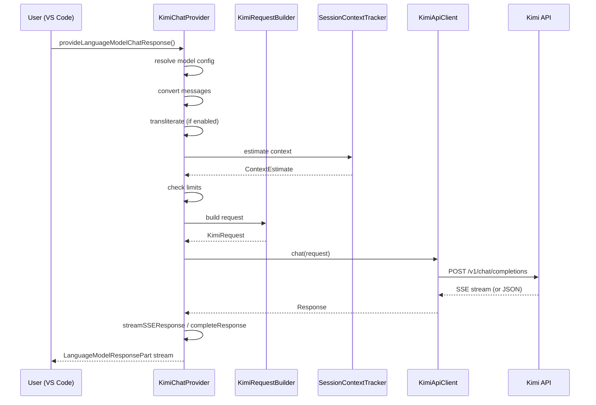
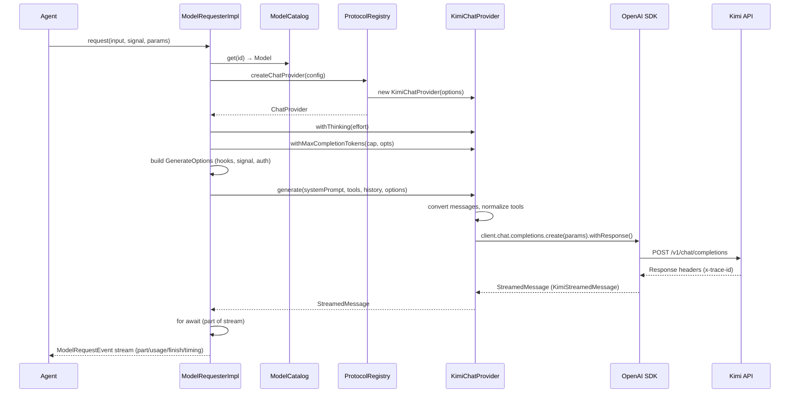

# Анализ API-запросов kimi-code и план улучшений kimi-copilot-provider

**Дата:** 2026-07-25  
**Автор:** Автоматический анализ кодовой базы  
**Ревизия:** v1.0

---

## Оглавление

1. [Введение](#1-введение)
2. [Архитектура API-запросов в kimi-code](#2-архитектура-api-запросов-в-kimi-code)
   - [2.1. Уровни абстракции](#21-уровни-абстракции)
   - [2.2. Провайдеры и протоколы](#22-провайдеры-и-протоколы)
   - [2.3. Модельный каталог](#23-модельный-каталог)
   - [2.4. Процесс выполнения запроса](#24-процесс-выполнения-запроса)
3. [Детальный анализ Kimi-провайдера](#3-детальный-анализ-kimi-провайдера)
   - [3.1. Конфигурация и параметры](#31-конфигурация-и-параметры)
   - [3.2. Сериализация сообщений](#32-сериализация-сообщений)
   - [3.3. Инструменты (Tools)](#33-инструменты-tools)
   - [3.4. Обработка thinking/reasoning](#34-обработка-thinkingreasoning)
   - [3.5. Стриминг](#35-стриминг)
   - [3.6. Обработка ошибок](#36-обработка-ошибок)
   - [3.7. Инструментация и трассировка](#37-инструментация-и-трассировка)
4. [Модельная система agent-core-v2](#4-модельная-система-agent-core-v2)
   - [4.1. Разрешение конфигурации](#41-разрешение-конфигурации)
   - [4.2. Бюджет Completion Tokens](#42-бюджет-completion-tokens)
   - [4.3. Система Thinking Effort](#43-система-thinking-effort)
   - [4.4. Аутентификация](#44-аутентификация)
5. [Сравнительный анализ: kimi-code vs kimi-copilot-provider](#5-сравнительный-анализ)
6. [Обнаруженные ограничения и различия](#6-обнаруженные-ограничения-и-различия)
7. [План улучшений kimi-copilot-provider](#7-план-улучшений-kimi-copilot-provider)
   - [7.1. Приоритет HIGH](#71-приоритет-high)
   - [7.2. Приоритет MEDIUM](#72-приоритет-medium)
   - [7.3. Приоритет LOW](#73-приоритет-low)

---

## 1. Введение

Настоящий документ содержит всесторонний анализ того, как репозиторий `kimi-code` (CLI/TUI приложение Kimi) выполняет запросы к LLM API, с фокусом на Kimi/Moonshot API. Цель анализа — выявить архитектурные решения, оптимизации и ограничения, реализованные в основном продукте Kimi, и на их основе предложить конкретные улучшения для VS Code расширения `kimi-copilot-provider`.

Анализ охватывает:
- Полный путь запроса от пользовательского ввода до ответа API
- Все слои абстракции: `kosong` (LLM-провайдеры) → `agent-core-v2` (DI/Scope движок) → `kap-server` (сервер)
- Обработку ошибок, retry-логику, стриминг, инструментацию
- Модельную конфигурацию, thinking effort, бюджет токенов

---

## 2. Архитектура API-запросов в kimi-code

### 2.1. Уровни абстракции

Запросы к LLM API проходят через четыре четко разделенных слоя:

```
┌──────────────────────────────────────────────────┐
│  apps/kimi-code (CLI/TUI)                        │
│  ↑ consume via @moonshot-ai/kimi-code-sdk         │
├──────────────────────────────────────────────────┤
│  packages/kap-server (REST + WebSocket)           │
│  ↑ /api/v1, /api/v1/ws                           │
├──────────────────────────────────────────────────┤
│  packages/agent-core-v2 (DI × Scope engine)       │
│  ↑ IModelCatalog → ModelRequester → ChatProvider   │
├──────────────────────────────────────────────────┤
│  packages/kosong (LLM abstraction)                │
│  ↑ ChatProvider interface, generate(), providers/  │
└──────────────────────────────────────────────────┘
```

- **kosong** (`packages/kosong`): Чистый слой абстракции LLM-провайдеров. Определяет интерфейс `ChatProvider`, контракты сообщений (`Message`, `ContentPart`), инструментов (`Tool`), потоковой передачи (`StreamedMessage`) и использования токенов (`TokenUsage`). Не имеет зависимостей от agent-core.

- **agent-core-v2** (`packages/agent-core-v2/src/kosong`): Слой интеграции, который связывает kosong с DI-движком. Включает:
  - `model/` — разрешение конфигурации моделей, каталог, `ModelRequester`
  - `protocol/` — регистрация протоколов и адаптеров
  - `provider/` — реестр провайдеров, определения, фабрики

- **kap-server**: HTTP/WS сервер, который предоставляет REST API поверх agent-core-v2.

### 2.2. Провайдеры и протоколы

Kimi-code использует систему **протоколов** и **определений провайдеров**:

**Протоколы** (низкоуровневые wire-форматы):
- `openai` — Chat Completions API
- `anthropic` — Anthropic Messages API
- `google-genai` — Google Generative AI
- `kimi` — Kimi/Moonshot специфичный протокол

**Провайдеры** (конкретные реализации):
- `KimiChatProvider` (`kimi.ts`) — реализует `ChatProvider` для Moonshot/Kimi API
- `AnthropicChatProvider` (`anthropic.ts`)
- `GoogleGenAIChatProvider` (`google-genai.ts`)
- `OpenAILegacyChatProvider` и `OpenAIResponsesChatProvider`

**Система traits**: Каждый провайдер регистрирует определения через `registerProviderDefinition()` с traits, которые могут переопределять поведение базового протокола. Например, Kimi регистрируется с `kimiOpenAITrait` (для native-транспорта) и `kimiAnthropicTrait` (для Anthropic-совместимого транспорта).

Эта архитектура позволяет:
- Переиспользовать общий код (openai-common.ts, chat-completions-stream.ts)
- Добавлять вендор-специфичные отклонения через traits
- Композировать признаки без хардкода

### 2.3. Модельный каталог

Модели конфигурируются декларативно в TOML-конфигурации (или через env). Каждая модель имеет:

```typescript
interface ModelRecord {
  providerId?: string;       // Structured: ссылка на [providers.*]
  baseUrl?: string;          // Flat: inline endpoint
  apiKey?: string;           // Inline API key
  oauth?: OAuthRef;          // OAuth-референс
  protocol?: Protocol;       // Явный протокол (openai/kimi/anthropic/...)
  name?: string;             // Wire-facing model name
  aliases?: string[];        // Routing keys для many-to-many
  maxContextSize?: number;   // Размер контекстного окна
  maxInputSize?: number;     // Максимальный входной размер
  maxOutputSize?: number;    // Максимальный выходной размер
  capabilities?: string[];   // Список возможностей
  reasoningKey?: string;     // Форсированный диалект reasoning
  adaptiveThinking?: boolean;
  supportEfforts?: string[]; // Поддерживаемые thinking efforts
  defaultEffort?: string;    // Дефолтный thinking effort
  // ...
}
```

Два пути конфигурации:
1. **Structured**: `providerId` → запись в `[providers.*]`
2. **Flat**: `baseUrl` + опционально `apiKey`/`oauth` прямо на модели

Каталог разрешается в `ModelCatalog` (catalogService.ts), который:
- Читает Model + Provider конфигурацию
- Разрешает auth-материал (Model.apiKey → Provider.apiKey → env vars)
- Собирает иммутабельный объект `Model` с `AuthProvider`
- Кэширует результат и инвалидирует по конфигурационным событиям

### 2.4. Процесс выполнения запроса

Полный путь одного запроса:

```
1. Agent (agent-core-v2) формирует входные данные:
   - systemPrompt, tools[], messages[], responseFormat

2. ModelRequesterImpl.request() получает вход + ModelRequestParams:
   - cacheKey, sampling, thinkingEffort, thinkingKeep,
     maxCompletionTokens, usedContextTokens, maxContextTokens

3. resolveChatProvider() — ленивое создание ChatProvider:
   - protocolRegistry.createChatProvider({ protocol, providerType, baseUrl, ... })

4. runRequest() формирует GenerateOptions:
   - onRequestStart → onRequestSent → onTraceId → onStreamEnd хуки
   - signal (AbortSignal) для отмены
   - auth (ProviderRequestAuth) для per-request credentials

5. generate() (kosong) вызывает provider.generate():
   - Преобразует messages → OpenAI-формат
   - Нормализует max_tokens → max_completion_tokens
   - Добавляет tools[], response_format, stream_options

6. KimiChatProvider.generate():
   - Конвертирует сообщения (с reasoning key detection)
   - Нормализует tool call IDs (санитизация до 64 символов)
   - Создает OpenAI SDK клиент (с auth)
   - Вызывает client.chat.completions.create().withResponse()
   - withResponse() разрешается на заголовках — trace-id доступен до тела

7. KimiStreamedMessage обрабатывает ответ:
   - Стриминг: convertStreamResponse() → chunk → part
   - Не-стриминг: convertNonStreamResponse()
   - Извлекает usage (top-level + choices[0].usage)
   - Детектирует reasoning-диалект
   - Нормализует finish_reason

8. ModelRequesterImpl собирает ModelRequestEvent stream:
   - part → usage → finish → timing события
   - buildStreamTiming(): TTFT, requestBuildMs, serverFirstTokenMs, decode stats

9. Обработка ошибок:
   - convertOpenAIError → typed APIStatusError
   - translateProviderError → coded Error2
   - 401 + OAuth → force refresh token + replay
   - AbortError → пробрасывается как стандартный DOMException
```

---

## 3. Детальный анализ Kimi-провайдера

### 3.1. Конфигурация и параметры

```typescript
// KimiChatProvider constructor
interface KimiOptions {
  apiKey?: string;
  baseUrl?: string;          // default: https://api.moonshot.ai/v1
  model: string;
  stream?: boolean;          // default: true
  defaultHeaders?: Record<string, string>;
  generationKwargs?: GenerationKwargs;
  clientFactory?: (auth: ProviderRequestAuth) => OpenAI;
}

interface GenerationKwargs {
  max_tokens?: number;               // Legacy alias
  max_completion_tokens?: number;    // Предпочтительный параметр
  temperature?: number;
  top_p?: number;
  n?: number;
  presence_penalty?: number;
  frequency_penalty?: number;
  stop?: string | string[];
  prompt_cache_key?: string;
  extra_body?: ExtraBody;            // thinking + любые другие поля
}
```

**Ключевые особенности:**
- `max_tokens` нормализуется в `max_completion_tokens` (Kimi предпочитает второй)
- `extra_body` позволяет передавать thinking и любые проприетарные поля
- `stream_options: { include_usage: true }` всегда добавляется при стриминге
- `client.chat.completions.create().withResponse()` — заголовки доступны до стрима

### 3.2. Сериализация сообщений

Функция `convertMessage()` выполняет следующие преобразования:

1. **Разделение thinking и контента**: `ThinkPart` извлекаются в отдельную строку reasoning
2. **Сборка контента**: одиночный текст → строка, массив → OpenAI content parts
3. **Пустой контент + tool_calls у assistant**: контент опускается (Kimi этого требует)
4. **Echo reasoning**: если thinking enabled, reasoning отправляется обратно под тем же ключом, который использовал сервер (`reasoning_content` / `reasoning` / `reasoning_details`)
5. **Message-level tools**: системные сообщения могут нести `tools[]` для динамической загрузки инструментов mid-conversation
6. **Нормализация tool call IDs**: обрезаются до 64 символов (ограничение Kimi API)

### 3.3. Инструменты (Tools)

```typescript
function convertTool(tool: Tool): OpenAIToolParam {
  if (tool.name.startsWith('$')) {
    // Kimi builtin functions — специальный тип
    return { type: 'builtin_function', function: { name: tool.name } };
  }
  // Обычные function tools с нормализацией JSON Schema
  return {
    ...toolToOpenAI(tool),
    function: { ...converted.function, parameters: normalizeKimiToolSchema(tool.parameters) }
  };
}
```

**Нормализация JSON Schema** (`kimi-schema.ts`):
- Дереференсит все `$ref` (inline definitions из `$defs`/`definitions`)
- Обнаруживает циклические ссылки и оставляет их как `$ref`
- Удаляет definition-бакеты после разрешения
- Дополняет отсутствующий `type` на основе структуры схемы
- Это критично, потому что Kimi API отклоняет схемы с неразрешенными `$ref`

### 3.4. Обработка thinking/reasoning

**Детекция диалекта** (`reasoning-key.ts`):
```
Inbound (прием): reasoning_content → reasoning_details → reasoning
Outbound (отправка): тот ключ, который использовал сервер
```

`ReasoningKeyDialect` запоминает, под каким ключом сервер вернул reasoning, и использует его же для отправки thinking обратно. Это позволяет работать с:
- Старым vLLM / Moonshot (`reasoning_content`)
- OpenRouter (`reasoning_details`)
- Новым vLLM (`reasoning`)

**Thinking конфигурация**:
```typescript
withThinking(effort: ThinkingEffort): KimiChatProvider {
  if (effort === 'off') thinking = { type: 'disabled' };
  else thinking = effort === 'on'
    ? { type: 'enabled' }
    : { type: 'enabled', effort };
  // carry over keep from withExtraBody
}
```

### 3.5. Стриминг

Класс `KimiStreamedMessage` реализует `StreamedMessage` с `AsyncIterable<StreamedMessagePart>`:

```typescript
async *_convertStreamResponse(response):
  for await (const chunk of response):
    - capture id, extract usage (top-level + choices[0].usage)
    - capture finish_reason
    - detect reasoning dialect → yield ThinkPart
    - yield text delta → TextPart
    - convert tool call deltas → ToolCall / ToolCallPart
```

**Буферизация tool calls** (`chat-completions-stream.ts`):
- OpenAI-совместимые провайдеры могут слать argument chunks до function name
- `BufferedChatCompletionToolCall` буферизует ранние аргументы до получения имени
- Параллельные tool calls различаются по `streamIndex`
- После получения имени эмитится полный `ToolCall` header, затем `ToolCallPart`

### 3.6. Обработка ошибок

**Классификация** (`errors.ts`):
```
APIConnectionError       → provider.connection_error
APITimeoutError          → (пробрасывается как abort)
APIStatusError:
  - 401/403              → provider.auth_error
  - 429                  → provider.rate_limit
  - 529                  → provider.overloaded
  - ContextOverflow      → context.overflow
  - остальное            → provider.api_error
APIEmptyResponseError    → (пустой ответ)
```

**Retry-логика** (только для OAuth):
- 401 на refreshable auth → force token refresh → ровно один replay
- 401 после refresh → `provider.auth_error` (аккаунт отклонен)

**Context overflow** помечен как retryable — позволяет движку перестроить контекст.

### 3.7. Инструментация и трассировка

Хуки в `GenerateOptions`:
```
onRequestStart  → засекает начало построения запроса
onRequestSent   → засекает отправку (разница = requestBuildMs)
onTraceId       → x-trace-id из заголовков ответа (до стрима)
onStreamEnd     → StreamDecodeStats: serverDecodeMs vs clientConsumeMs
```

`StreamDecodeStats` разделяет время на:
- `serverDecodeMs` — ожидание следующего чанка (сервер + сеть)
- `clientConsumeMs` — обработка чанка в JS (колбэки, мерж)

`buildStreamTiming()` вычисляет:
- `firstTokenLatencyMs` — от старта запроса до первого токена
- `streamDurationMs` — от первого токена до конца стрима
- `requestBuildMs` — построение запроса
- `serverFirstTokenMs` — серверное время до первого токена
- `serverDecodeMs`, `clientConsumeMs` — из StreamDecodeStats

---

## 4. Модельная система agent-core-v2

### 4.1. Разрешение конфигурации

Цепочка приоритетов для каждого параметра:
1. **Per-model config** (modelConfig overrides)
2. **Global settings** (общие настройки)
3. **Hard-coded model defaults** (из реестра моделей)
4. **Provider definition** (env vars для endpoint/ключа)
5. **Built-in fallback**

### 4.2. Бюджет Completion Tokens

```typescript
computeCompletionBudgetCap({ budget, capability }) {
  hardCap ?? maxContextTokens ?? fallback(32K) → cap ≥ 1
}

// Клампинг против контекстного окна
withMaxCompletionTokens(maxCompletionTokens, { usedContextTokens, maxContextTokens }) {
  cap = Math.min(cap, maxContextTokens - usedContextTokens)
  return Math.max(1, cap)
}
```

**Правило**: `usedContextTokens` передается ТОЛЬКО когда сообщения НЕ были переопределены явно. Это предотвращает ложное зажатие бюджета при ручном override.

### 4.3. Система Thinking Effort

`resolveThinkingEffortForModel()` — полный алгоритм:

1. Запрашиваемый effort (из ModelRequestParams)
2. Конфигурационный default effort (из `[thinking]`)
3. Модельный default effort (из supportEfforts/defaultEffort)
4. **alwaysThinking** guard: модель с `always_thinking: true` никогда не получает `'off'`
5. Если effort не поддерживается → fallback к model default
6. **Strict validation** (для Kimi native): неподдерживаемый effort → ошибка/warn
7. **Lenient validation** (для Kimi через Anthropic): warn-and-send

`wireHasProtocolThinkingDisable()`: только `anthropic` и `kimi` протоколы кодируют настоящее `thinking: { type: 'disabled' }`. На остальных "off" означает отсутствие поля effort.

### 4.4. Аутентификация

`resolveModelAuthMaterial()` — цепочка:
```
Model.apiKey       → apiKey
Model.oauth        → oauth + oauthProviderKey
Provider.apiKey    → apiKey (из конфига или env bag)
Provider.oauth     → oauth + oauthProviderKey
```

`AuthProvider` интерфейс:
- `StaticAuthProvider` — статичный API key, never refreshes
- OAuth-бекенды — `canRefresh: true`, поддерживают `force: true`

`runWithAuthRefresh()` в ModelRequesterImpl:
- 401 → force refresh → replay (ровно один раз)
- 401 после refresh → `provider.auth_error`

---

## 5. Сравнительный анализ: kimi-code vs kimi-copilot-provider

| Аспект | kimi-code | kimi-copilot-provider | Разрыв |
|--------|-----------|----------------------|--------|
| **HTTP клиент** | OpenAI SDK (`openai` npm) | `fetch()` напрямую | ❌ |
| **Стриминг** | OpenAI SDK + `withResponse()` | Ручной SSE-парсинг | ⚠️ |
| **Trace ID** | `x-trace-id` из заголовков (до стрима) | Не извлекается | ❌ |
| **Reasoning диалект** | Авто-детекция (3 ключа) | Только `reasoning_content` | ⚠️ |
| **Echo thinking** | Поддерживается (keep:'all') | Не поддерживается | ❌ |
| **JSON Schema нормализация** | `$ref` dereference + type inference | Отсутствует | ❌ |
| **Message-level tools** | `messages[].tools` | Отсутствует | ❌ |
| **Completion budget clamp** | Против context window | Фиксированный maxTokens | ⚠️ |
| **Thinking effort resolution** | Модель-специфичный + strict/lenient | Простой enabled/disabled | ❌ |
| **Model catalog** | Protocol-aware + env bag resolution | Статичный MODELS[] + /models refresh | ⚠️ |
| **Auth refresh (OAuth)** | 401 → force refresh → replay | Отсутствует | N/A |
| **Инструментация** | TTFT, decode stats, requestBuildMs | Только общее время запроса | ⚠️ |
| **Retry-логика** | Уровень kosong (AbortError guard) | Уровень api-client (429/5xx) | ≈ |
| **Обработка ошибок** | Typed APIStatusError + Error2 codes | Chain of Responsibility + LanguageModelError | ≈ |
| **Контекст-трекинг** | На уровне движка (compaction) | SessionContextTracker + авто-compact | ≈ |
| **Body size guard (2 MiB)** | Нет явного (на уровне движка) | Есть (context-tracker) | ✅ |
| **Видео-загрузка** | `KimiFiles.uploadVideo()` | Отсутствует | ❌ |
| **Request Policy (K2/K3)** | Protocol traits (декларативно) | Strategy pattern (явно) | ≈ |
| **Tool call ID санитизация** | Обрезка до 64 символов | Отсутствует | ❌ |
| **Sampling параметры** | Per-turn через ModelRequestParams | Per-model config override | ≈ |
| **Транслитерация** | Отсутствует | Поддерживается | ✅ |

---

## 6. Обнаруженные ограничения и различия

### 6.1. Критические различия

#### 6.1.1. Отсутствие OpenAI SDK
kimi-copilot-provider использует сырой `fetch()` и ручной SSE-парсинг. Это:
- Не позволяет получить `x-trace-id` до начала стрима (заголовки ответа недоступны в fetch API до получения тела)
- Усложняет обработку ошибок (нужно вручную классифицировать статусы)
- Требует ручного парсинга SSE (`data: [DONE]`, chunk aggregation)

#### 6.1.2. Отсутствие авто-детекции reasoning диалекта
Kimi API может вернуть reasoning под `reasoning_content`, `reasoning` или `reasoning_details`. kimi-copilot-provider жестко ожидает только `reasoning_content`. При смене диалекта на новый vLLM thinking-контент не будет отображен пользователю.

#### 6.1.3. Нормализация JSON Schema для tools
Kimi API **отклоняет** схемы инструментов с неразрешенными `$ref`. kimi-code решает это через `derefJsonSchema()` + `normalizeKimiToolSchema()`. kimi-copilot-provider передает схемы "как есть", что может приводить к ошибкам API при использовании Copilot Chat tool calling со сложными схемами (например, VS Code MCP tools).

#### 6.1.4. Инструментация запросов
kimi-copilot-provider логирует только общее время запроса. kimi-code предоставляет детальную разбивку: время построения запроса, серверное TTFT, декодирование, время обработки клиентом. Это критично для диагностики проблем с производительностью.

### 6.2. Существенные различия

#### 6.2.1. Completion Budget
kimi-code клампит `max_completion_tokens` против оставшегося места в контекстном окне: `cap = Math.min(requestedCap, maxContextTokens - usedContextTokens)`. kimi-copilot-provider передает фиксированный `maxTokens` без учета заполненности контекста.

#### 6.2.2. Thinking Effort
kimi-code поддерживает полный спектр thinking effort resolution: `'off'`, `'on'`, `'low'`, `'high'`, `'max'` — с модель-специфичной валидацией и `alwaysThinking` guard. kimi-copilot-provider поддерживает только `enabled`/`disabled` + `reasoningEffort` (только для K3).

#### 6.2.3. Message-level Tools
kimi-code поддерживает динамическую загрузку инструментов через `messages[].tools` — возможность добавлять инструменты в середине диалога. kimi-copilot-provider не поддерживает эту функцию.

#### 6.2.4. Echo Thinking (keep)
kimi-code может отправлять предыдущий reasoning обратно в API при `thinking.keep: 'all'` — это позволяет моделям "помнить" свои размышления между шагами. kimi-copilot-provider всегда обрезает reasoning.

### 6.3. Уникальные возможности kimi-copilot-provider

- **Транслитерация кириллицы** — уникальная функция, снижающая размер тела запроса для русскоязычных пользователей (~2× меньше байт)
- **2 MiB body guard** — явная проверка размера тела запроса, отсутствующая в kimi-code на уровне провайдера
- **Авто-compact** — интеграция с `/compact` командой Copilot Chat
- **VS Code модель-пикер интеграция** — `isBYOK`, `isUserSelectable`, pricing metadata для UI

---

## 7. План улучшений kimi-copilot-provider

### 7.1. Приоритет HIGH

#### H-1. Переход на OpenAI SDK

**Проблема**: Ручной `fetch()` + SSE-парсинг не позволяет извлечь `x-trace-id` из заголовков до начала стрима и усложняет поддержку.

**Решение**: Использовать `openai` npm пакет (уже есть в kimi-code).

**Что изменится**:
- `api-client.ts` заменяется на `new OpenAI({ apiKey, baseURL })`
- `client.chat.completions.create(params).withResponse()` дает доступ к заголовкам
- Автоматический SSE-парсинг, обработка ошибок SDK

**Риски**: Увеличение размера бандла (~200KB). Митигируется tree-shaking.

**Оценка**: 4-6 часов.

#### H-2. Авто-детекция reasoning диалекта

**Проблема**: Жесткая привязка к `reasoning_content` сломается при переходе Kimi API на новый vLLM.

**Решение**: Портировать `reasoning-key.ts` из kimi-code:
- Сканировать `reasoning_content`, `reasoning`, `reasoning_details`
- Запоминать обнаруженный диалект
- Использовать его же для отправки thinking обратно

**Оценка**: 2-3 часа.

#### H-3. Нормализация JSON Schema для tools

**Проблема**: Kimi API отклоняет схемы с `$ref`, что ломает Copilot Chat tool calling.

**Решение**: Портировать `kimi-schema.ts` (функции `derefJsonSchema` и `normalizeKimiToolSchema`):
- Дереференсить все `$ref` из `$defs`/`definitions`
- Обнаруживать циклические ссылки
- Дополнять отсутствующий `type`

**Что изменится**: В `request-builder.ts`, после добавления tools, прогонять их схемы через нормализацию.

**Оценка**: 3-4 часа.

### 7.2. Приоритет MEDIUM

#### M-1. Улучшенная инструментация

**Проблема**: Сейчас логируется только общее время запроса. Невозможно диагностировать, проблема на стороне клиента или сервера.

**Решение**: Добавить измерения по образцу kimi-code:
- `TTFT` (Time To First Token) — от отправки запроса до первого чанка
- `requestBuildMs` — время построения запроса
- `serverDecodeMs` — время между чанками (сервер + сеть)
- `clientConsumeMs` — время обработки чанка
- `x-trace-id` в логах для корреляции с серверными логами

**Что изменится**: Добавление `timing` информации в output channel.

**Оценка**: 2-3 часа.

#### M-2. Completion Budget с учетом контекстного окна

**Проблема**: `maxTokens` всегда фиксированный, игнорирует оставшееся место в контексте.

**Решение**: В `context-tracker.ts` добавить расчет оставшегося места:
```
effectiveMaxTokens = Math.min(
  requestedMaxTokens,
  contextWindow - estimatedUsedTokens
)
```

**Что изменится**: Меньше ошибок "context length exceeded" при длинных диалогах.

**Оценка**: 2 часа.

#### M-3. Улучшенная обработка thinking effort

**Проблема**: Thinking effort поддерживается только для K3, для K2 — только enabled/disabled.

**Решение**: Расширить `request-policy.ts`:
- K2 Policy: поддерживать `reasoning_effort` опционально
- Добавить модель-специфичную информацию о поддерживаемых efforts в `models.ts`
- Валидировать effort против модели перед отправкой

**Оценка**: 3-4 часа.

#### M-4. Санитизация tool call IDs

**Проблема**: Kimi API требует tool call IDs не длиннее 64 символов.

**Решение**: В `request-builder.ts` или при конвертации сообщений обрезать ID до 64 символов (как в `tool-call-id.ts` из kimi-code).

**Оценка**: 1 час.

### 7.3. Приоритет LOW

#### L-1. Echo thinking (keep)

**Проблема**: Reasoning теряется между шагами. Модель не видит свои предыдущие размышления.

**Решение**: Добавить опцию `thinkingKeep` в per-model конфигурацию. При `keep: 'all'` отправлять reasoning обратно в API.

**Что изменится**: Улучшение качества при многошаговых диалогах с thinking.

**Оценка**: 2-3 часа.

#### L-2. Message-level tools

**Проблема**: Невозможно добавлять инструменты в середине диалога.

**Решение**: Поддержать `messages[].tools` — позволить системным сообщениям нести определения инструментов. Требует изменений в конвертации сообщений и сигнализации capabilities.

**Оценка**: 3-4 часа.

#### L-3. Retry на context overflow

**Проблема**: При ошибке context length запрос просто падает.

**Решение**: При получении `context.overflow` от API, пометить ошибку как retryable (как в kimi-code), чтобы движок Copilot Chat мог автоматически перестроить контекст.

**Оценка**: 1 час.

#### L-4. Улучшение модельного каталога

**Проблема**: Статичный `MODELS[]` массив требует ручного обновления при добавлении новых моделей.

**Решение**: Расширить парсинг `/models` ответа для получения полной информации о модели (по аналогии с kimi-code `models-client.ts`):
- `think_efforts` → supportEfforts + defaultEffort
- `supports_thinking_type` → валидация thinking конфигурации
- `supports_image_in`, `supports_video_in` → capabilities

**Оценка**: 2-3 часа.

---

## Приложение A: Быстрые ссылки на ключевые файлы

### kimi-code (источник)
| Файл | Назначение |
|------|-----------|
| `packages/kosong/src/providers/kimi.ts` | KimiChatProvider — основная реализация |
| `packages/kosong/src/providers/kimi-schema.ts` | Нормализация JSON Schema для Kimi API |
| `packages/kosong/src/providers/reasoning-key.ts` | Авто-детекция диалекта reasoning |
| `packages/kosong/src/providers/chat-completions-stream.ts` | Стриминг tool calls |
| `packages/kosong/src/providers/openai-common.ts` | Общий код OpenAI-провайдеров |
| `packages/kosong/src/providers/request-auth.ts` | Разрешение auth |
| `packages/kosong/src/providers/tool-call-id.ts` | Санитизация tool call IDs |
| `packages/kosong/src/errors.ts` | Иерархия ошибок |
| `packages/agent-core-v2/src/kosong/model/thinking.ts` | Разрешение thinking effort |
| `packages/agent-core-v2/src/kosong/model/completionBudget.ts` | Бюджет completion tokens |
| `packages/agent-core-v2/src/kosong/model/modelRequesterImpl.ts` | Исполнитель запросов |
| `packages/agent-core-v2/src/kosong/protocol/errors.ts` | Трансляция ошибок в Error2 |
| `packages/agent-core-v2/src/kosong/model/catalogService.ts` | ModelCatalog — сборка Model |

### kimi-copilot-provider (цель улучшений)
| Файл | Назначение |
|------|-----------|
| `src/provider.ts` | KimiChatProvider (VS Code) |
| `src/request-builder.ts` | Построитель запросов (Builder pattern) |
| `src/request-policy.ts` | K2/K3 политики (Strategy pattern) |
| `src/api-client.ts` | HTTP клиент (Facade pattern) |
| `src/context-tracker.ts` | Оценка контекста |
| `src/error-handlers.ts` | Обработка ошибок (Chain of Responsibility) |
| `src/models.ts` | Статичный реестр моделей |
| `src/models-client.ts` | Клиент /models endpoint |
| `src/model-registry.ts` | Реестр моделей (runtime) |
| `src/types.ts` | API типы |

---

## Приложение B: Диаграмма потока запроса





---

*Конец отчета.*
